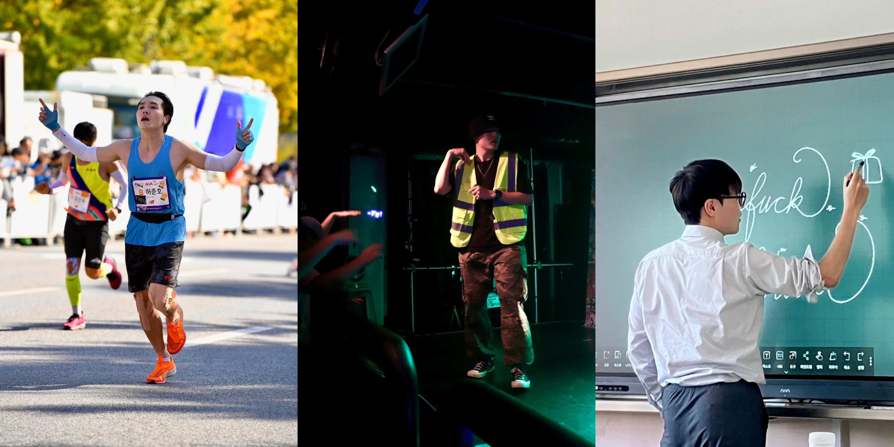

<!-- 자기소개 -->
# 🎄기처리의 공작소!🎶
여러 고난과 역경이 도사리는 개발자 시장에 **기처리**가 떴다!!
그는 **프론트엔드 엔지니어**에 도전한다고 하는데?!
그의 열정 넘치는 행보를 응원해 보려 한다..🤪

- 🌱 그가 배우고 있는 것은.. **배울 수 있는 모든 것**  
- 🚀 그의 취미는.. **랩🎤 / 달리기🏃‍♂️ / 컴퓨터수업(?)🧑‍🏫**  
- 📫 그의 연락처는.. **gichul@kakao.com**
- 🤸 그의 풀마라톤 PB는.. **03:00:30(2024 JTBC 마라톤)** 

---

<!-- 기술 스택 -->
### 🛠️ 기처리의 기술 스택

  <!-- Frontend -->
  
  
  
  
  
  
  
  <!-- Tools -->
  
  
  

---

<!-- GitHub Stats -->
### 📊 깃허브 스탯

  
  

---

<!-- Contact -->
### 📫 연락주세요..

  
  

