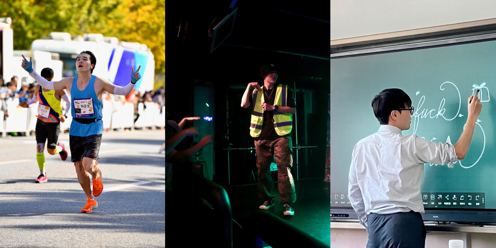

# 🏠 기처리의 공작소 (GichuL's Workshop)

---
### 🫢★기처리의 공작소 운영 3원칙(GichuL's Workshop Rules!)★🎧
**1. 성장의 기반은 정확한 문제 이해부터 시작입니다.  
2. 공작소의 모든 결정은 고객님이 편하게 제품을 쓸 수 있는 방향으로 결정합니다.  
3. 더 나은 제품은 동료들과 함께 만들어 가야 합니다.**
> *1. Growth starts with a precise understanding of the problem.*  
> *2. Every decision is made to make the product easier and more comfortable for users.*  
> *3. Better products are built together, not alone.*

---
### 🎬 Intro Video — “기처리는 어떤 사람일까요?!"

---

## 📋 그의 프로필.. (Profile)

### 🎓 Education
건국대학교 컴퓨터공학부 (교직과정 이수) 
Konkuk University – B.S. in Computer Science Engineering (with College of Education Track) 
> 2019.03 ~ 2026.02 (학사 / bachelor's degree) 
> GPA (전체 / Overall): 4.01 / 4.5  
> GPA (전공 / Major): 4.07 / 4.5

### 🪪 Certificate/License
- **TOEIC Speaking AL (160)** – 2024년 9월 취득 (Sep 2024)  
- **SQLD (SQL Developer)** – 2025년 4월 취득 (Apr 2025)  
- **정보처리기사 (Engineer Information Processing)** – 2025년 6월 취득 (Jun 2025)

### 🏃 Experience
- **건국대학교 중앙힙합동아리 워너패밀리 음악팀장** (2020.01 – 2020.12)  
*Head of Music Team, Wanna Family (Konkuk University Central Hip-Hop Club)*

- **건국대학교 중앙러닝동아리 RIKU 부회장** (2023.07 – 2023.12)  
*Vice President, RIKU (Konkuk University Central Running Club)*

- **LG U+ 유레카 2기 프론트엔드 개발자 교육과정 (우수 훈련생 수상)** (2025.01 – 2025.08)  
*Frontend Developer Trainee, Eureka 2nd period Program with LG Uplus (Awarded as Outstanding Trainee)*

- **ZUZU (코드박스) 소프트웨어 엔지니어 인턴** (2025.12 – 현재)  
*Software Engineer Internship at ZUZU(Kodebox)*

### 😎 TMI (Too Much Information)
기처리는 **"웃기지만 우습지 않은 사람이 되자"** 라는 말을 좌우명으로 삼고, 열정적으로 삽니다.

그는 배우는 데 있어서 열정이 넘치는 사람입니다.
'배울 수 있는 건 다 배우면서 즐겁게 살고 싶다'는 마음으로 컴퓨터 전공 외에도 교육, 음악, 러닝 등 다양한 영역에 발을 들이고 있습니다.
그중에서도 가장 오래 사랑해 온 것은 음악, 특히 힙합 음악입니다.
힙합 장르의 트랙과 다양한 믹스테잎을 SoundCloud에 종종 업로드하며, 창작자로서의 감각도 놓치지 않으려 노력합니다.

한편, 뛰는 것도 참 좋아하는 사람입니다.
2024 JTBC 서울 마라톤에서 풀코스 3시간 30초를 기록할 만큼, 운동을 열심히 해서 항상 건강하게 살려고 노력하는 편입니다.

잠깐! 왜 기처리라고 부르냐고요?
예전엔 '기가 철철 넘친다' 해서 기처리라고 불렀는데…
이젠 제품을 만드는 사람으로서 **'좋은 제품을 만들어서 문제를 확실히 처리할 거다'** 는 확고?한 다짐도 담겨 있는 이름이 되었네요.

랩과 러닝, 그리고 이젠 코딩·기획까지 —
리듬과 건강, 이젠 논리력까지.. 동시에 다루며
**"배우고, 만들고, 나누는 삶"** 을 살아가고자 하는 사람이 되고자 항상 노력하겠습니다🥹💪

> *A programmer·director, rapper, and runner, **GichuL** lives by one motto:*
> *stay humble, keep building, and never stop learning.*

### 🛠️ Tech Stack
<table>
  <tr>
    <th scope="col" width="50%" align="center">Front-End</th>
    <th scope="col" width="50%" align="center">Collaboration / Tools</th>
  </tr>
  <tr>
    <td width="50%" align="center">
      
      
      
      
      
      
      
      
      
      
      
    </td>
    <td width="50%" align="center">
      
      
      
    </td>
  </tr>
  <tr>
    <th scope="col" width="50%" align="center">Back-End</th>
    <th scope="col" width="50%" align="center">Algorithm (노력중입니다..😂)</th>
  </tr>
  <tr>
    <td width="50%" align="center">
      
      
       
      
      
    </td>
    <td width="50%" align="center">
      
    </td>
  </tr>
</table>

### 📲 Feel Free to Reach Out!

